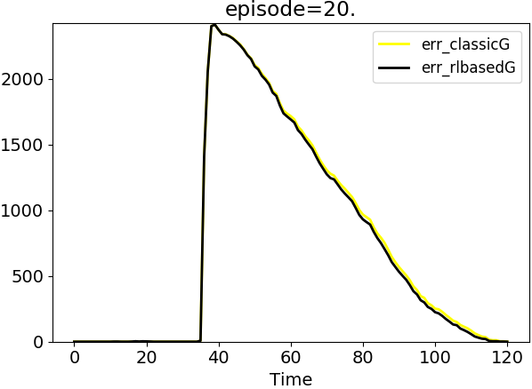

## 16/11/20
Add Independent GQRL concept, following the idea of some distributed swarm reinforcement learning approaches

## 19/11/20
Fixing the time problems, seems that the algorithms reach a stable sub-optimal policy.
 * Initial configuration 
 * Final configuration 
This result is reached using ConcentratedProgramRL using the task *concentratedGRL*
This is a sub-optimail solution, but finally the aggregate converge to a policy:

 * [*Q-table learn]()
  