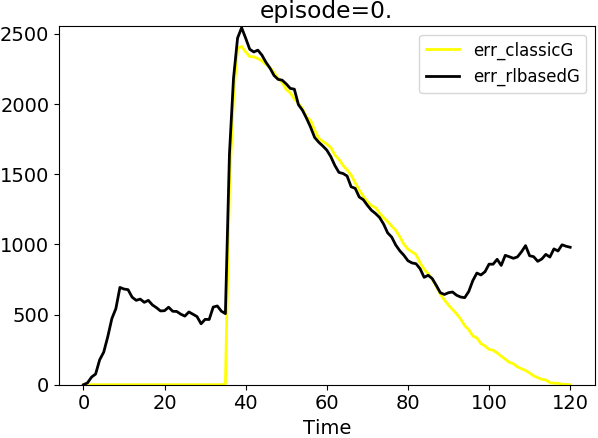

## 16/11/20
Add Independent GQRL concept, following the idea of some distributed swarm reinforcement learning approaches

## 19/11/20
Fixing the time problems, seems that the algorithms reach a stable sub-optimal policy.
 * Initial configuration 
 * Final configuration 
This result is reached using ConcentratedProgramRL using the task *concentratedGRL*
This is a sub-optimail solution, but finally the aggregate converge to a policy:

 * [*Q-table learned](result/19-11-20/result-20-concentrated.txt)
  
## 23/11/20
A robust refactor is need to clarify the library and the usage in the aggregate programming context. 

The results founded in 19-11-20 might have problems; the state evolution is perceived centrally by the server.
But violate the "locality" perception of nodes. In the gradient example, imagine that the source is moved
from a node to another. At a certain moment, the node state 
evaluation returns "NormalState". In the previous moment,
a node sensed a RisingSlowlyState and performs "NoAction". 
Our desired configuration is NormalState. 
So, globally, the central mind sensed that the system was 
in RisingSlowlyState, and performing no action, it became 
NormalState. This makes it seem that "RisingSlowlyState" and 
"NoAction" is a good state/action pair!

If I evaluated the state evolution locally, the system doesn't converge anymore again...

## 25/11/20
A simple experiment similar to k-armed bandit examples. Each node should choose one of three "bandit": C block, T block, and G block. In this experiment, the state space isn't considering. 

I could use one of Monte Carlo methods, but currently, I try only with the single-agent Q-learning method. 
The agent should learn what block computes the gradient from a source. 

The reward function is:
```scala
- Math.abs(aggregateProgramResult - realEuclideanDistance)
```
 
This is possible because I imagine that exists a central mind that has a clear vision of all nodes.
Briefly, the configuration of Q-Learning algorithm is:

**State** : *NoState*

**Actions**: *TConstruct*, *GConstruct*, *CConstruct*
algorithm:

```scala
// file BasicTGC
val t = T(10)
val g = distanceTo(source)
val c = C[Double, Int](g, _ + _, 1, 0)
action match {
    case TConstruct => t
    case GConstruct => g
    case CConstruct => c
}
```

The learning process is dived into episodes. Each episode last 100 simulated time units. The policy chosen is an epsilon-greedy policy, in which epsilon decrease following this formula:
```scala
Math.min(0.9, Math.exp(-0.5 * t))
```
The simulation is composed of 100 nodes dispatched in a grid.

After 24 episodes, the algorithm converges in the optimal policy (**NoState** -> **GConstruct**).
In the following, some plots resume the temporal progression of the error between the aggregate program output and the euclidean distance.
 * Initial error 
 * During learning 
 * Final result 
 * [*Q-table learned](result/25-11-20/result-40.txt)